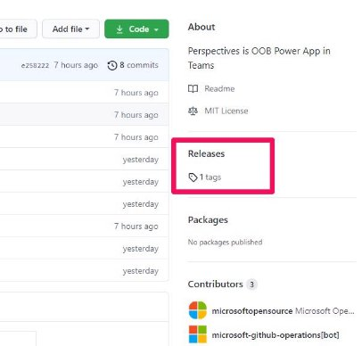
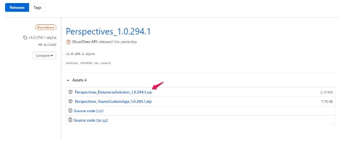
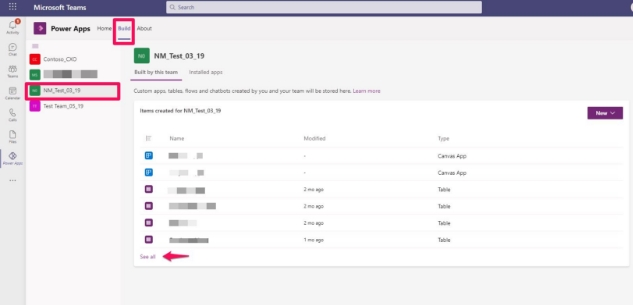
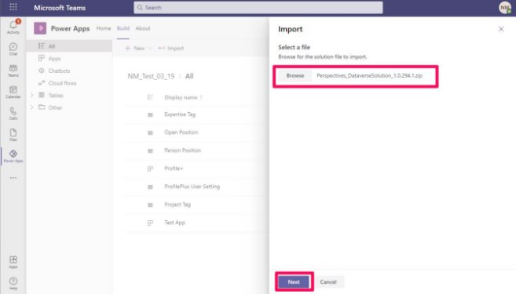
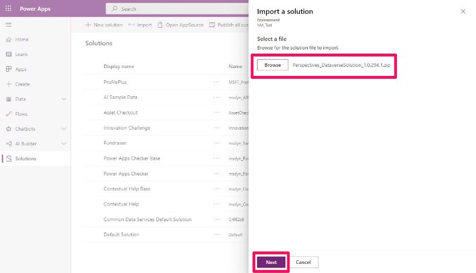
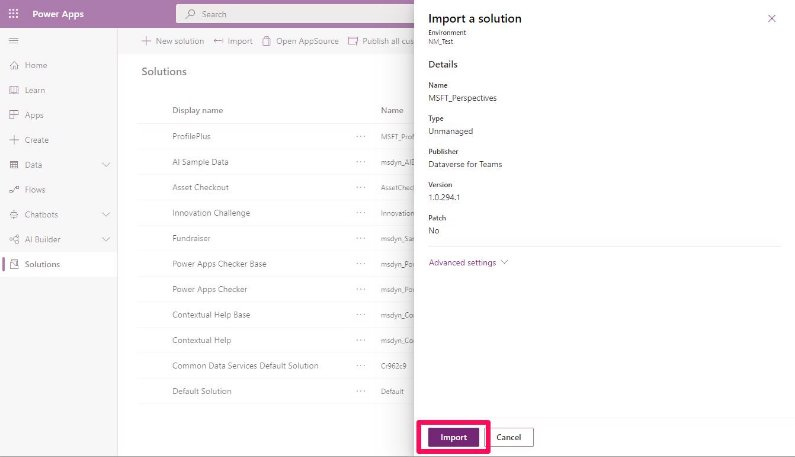

# Import Perspectives as a managed solution into Dataverse environment 

This document provides instructions on how to add the components of Perspectives app in a *Dataverse* or *Dataverse for Teams* environment as a managed solution.  

## Contents 

1. [Download the managed Solution file](#p1)
1. [Import the solution in Dataverse for Teams](#p2)
1. [Import Solution in Dataverse environment](#p3)
---

## Download the managed Solution file

1. Browse to the Releases section of github repository 

   

1. Review the assets for latest release and download the ‘Perspectives\_DataverseSolution\_<Version>.zip’ file 

   

## Import the solution in Dataverse for Teams

1. Open Teams. Go to the Power Apps app within Teams (Install the app from Teams app store if needed) 

   

1. Browse to the Teams team environment where you’d like to import the solution. Select See All. 

   

1. Click the “Import” button. 

   

1. Browse to the Dataverse Solution file downloaded in [Download the managed Solution file](#p1) step and click Next. 

   

1. Select the components you want to import (recommended you select all) and click on Import 

   

The import process will start in background.

## Import Solution in Dataverse environment

1. Go to make.powerapps.com. Select the environment you want to import the solution to. Go to Solutions section. Select Import.

   

1. Browse to the Dataverse Solution downloaded in [Download the managed Solution file](#p1) step. Click Next.

   

1. Click Import.

   

Solution import will begin in the background.
