# Install Perspectives in Teams

This document provides instructions to install the Perspectives application in Teams.   

## Contents 

1. [Download the Teams Custom App File](#p1)
1. [Install the Custom App in Teams](#p2)
1. [Run and extend the app](#p3)
1. [Known Issues](#p3)
---

## Download the Teams Custom App File

1. Browse to the Releases section of github repository 

   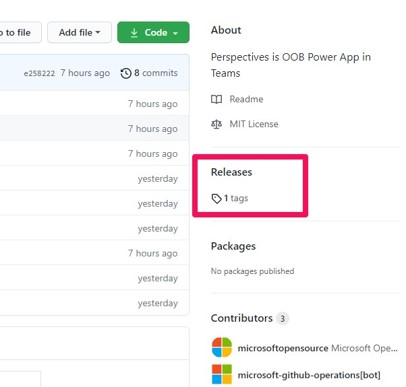

1. Review the assets for latest release and download the ‘Perspectives_TeamsCustomApp_<Version>.zip’
file

   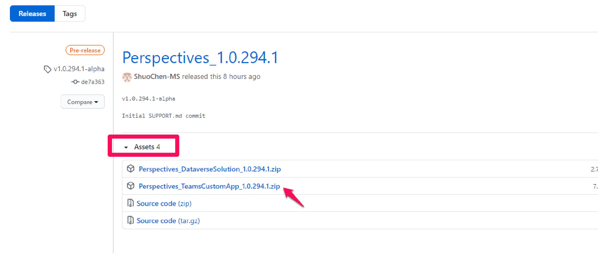

## Install the Custom App in Teams

1. Open Teams, go to app store. Click on upload a custom app. 

   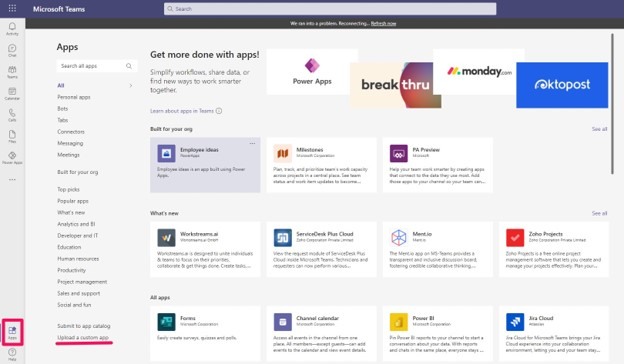

   Note: ‘Upload a custom app’ option needs to be enabled by your Teams admin. Please contact your Teams admin if you do not see this option for you. You can learn more about uploading customer apps on Teams here: [Upload your custom app - Teams | Microsoft Docs](https://docs.microsoft.com/en-us/microsoftteams/platform/concepts/deploy-and-publish/apps-upload)

1. Browse to the Teams Custom App zip file downloaded in step 1.2. You will be prompted with a dialog to select the team in which you would like to install the app. 

   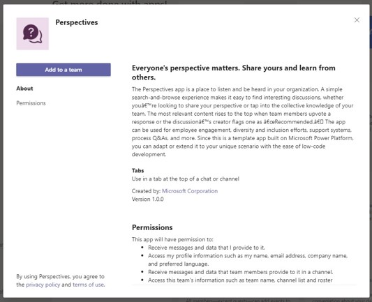

1. Select the Teams team and channel where you want to install the app. Click on “Set up a tab” 

   

   Note: Once installed, you can change the location of tabs within the team. You can also share the app with members in your organization outside the specific Teams team. It is best to select the Teams team where whose members include people who are likely to extend the app or administer the app.

1. Click on Save to start the installation process. 

   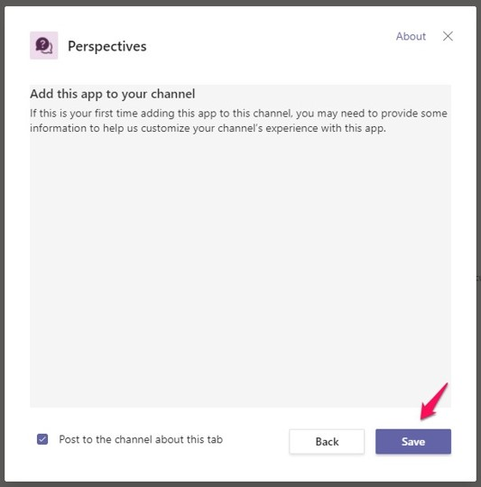

   Note: The installation may take up to 2 – 3 minutes to complete. During the installation, you are getting a local copy of the database and the applications. The finished application is functional out of the box, but since you have the local copy and full access to source code, you can customize or extend the experience using Power Platform’s low-code development framework.

   During installation, you will see the following screen. You can continue your work within Teams while the installation is being completed. Once complete, you will get an activity feed notification and an email notifying the completion of the installation process.

   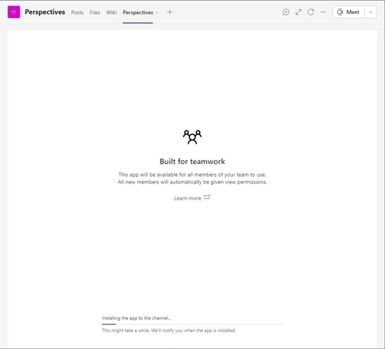

## Run and extend the app

Once installed, you can run the app within Teams by accessing the Boards tab in the channel where you installed the app. 

You can find additional instructions on using the app here: https://aka.ms/TeamsBoardsDocs

You can find instructions on how to customize or extend the app here: https://docs.microsoft.com/en-us/powerapps/teams/customize-sample-apps

You can explore additional Power Apps template applications to be used within Teams here:

## Known Issues

   After installation, you may get a notification that the app installed successfully:

   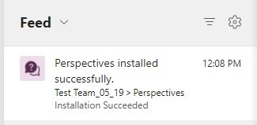

   But you do not see the tab being added to the channel where you installed it.
   Or you may see the following error at the end of the installation:

   

   In either of these cases, you can validate if the app installed correctly by going to Power Apps personal
   app, and checking for the presence of the app in “Installed Apps” section of the specific Teams team.

   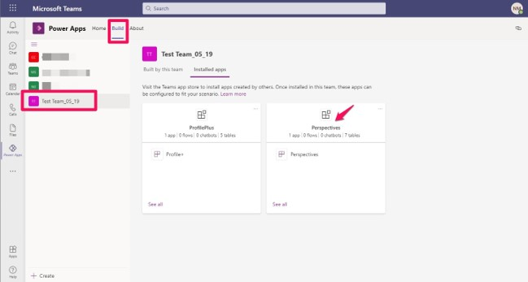

   If you cannot locate the app here, you should retry installing.
   If you can locate the app here, you have successfully installed the app and need to re-add the tab using the instructions below.

   Go to the Teams team channel where you want to add the tab. Click on “+” icon on top to add a tab.

   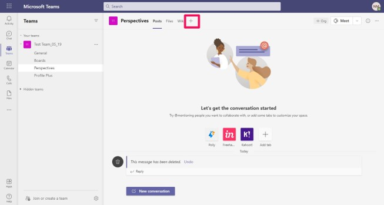

   Search for and launch the “Power Apps” app.

   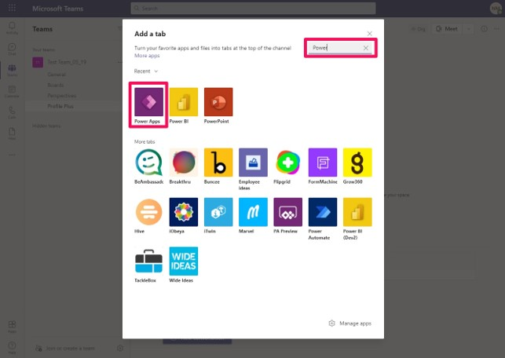

   The Power Apps will give options for all apps that can be tabbed. Look for the app you recently installed by searching for ‘Boards’.
   You may see multiple versions of the app if you have installed it in multiple teams. Select the team inwhich you are pinning this app (in this example, the Boards app from “Test Team_05_19”) and click “Save”.

   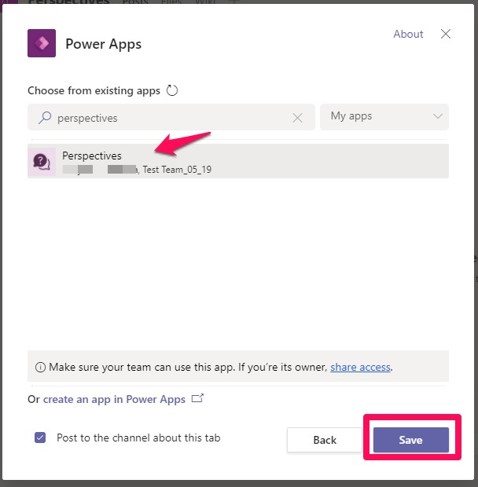

   The tab should be successfully added to the Teams team channel.

   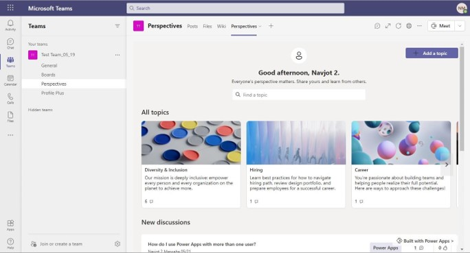